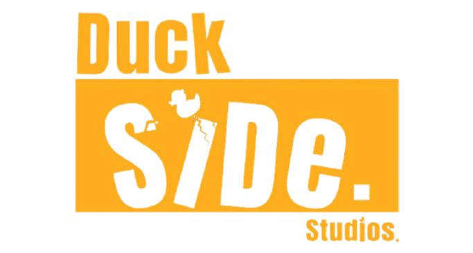

<div align="center">
  
  <h1>Duckside Launcher</h1>
  <p><strong>O portal para o Project Zomboid RP 3D da Duckside Studios.</strong></p>
  <p>
    
    
    
    <a href="https://github.com/Th14goAlvex/duckside-launcher/actions/workflows/validate.yml"></a>
  </p>
</div>

Launcher desktop em Electron para reunir notícias, personagens, status do servidor e preparação da experiência RP em um único lugar. O projeto está em fase de protótipo: a conexão real com o jogo e o executor Java ainda será integrada.

## O que já está no projeto

- Interface Duckside responsiva, quatro temas e preferências locais.
- Tela de notícias e avisos com vídeo sem controles nativos, além de suporte opcional a vídeo de fundo.
- Prévia de personagens (o modelo real do Project Zomboid ainda depende do executor/mod).
- Aplicativo Electron com instalador Windows NSIS.
- Backend Node.js para Steam OpenID, contas vinculadas a SteamID, conteúdo, notícias, mídias e status do servidor.
- Painel de teste local aberto: as alterações locais não se tornam públicas. A API continua exigindo autorização de admin para publicar ou enviar arquivos.

## Baixar o launcher

Abra [Releases](https://github.com/Th14goAlvex/duckside-launcher/releases) e baixe o instalador Windows mais recente. Os instaladores de teste podem não ter assinatura Authenticode e o Windows pode mostrar um aviso de segurança.

## Executar durante o desenvolvimento

Requisitos: Windows, Node.js 24 ou superior e npm.

```powershell
npm ci
npm start
```

Para gerar o instalador:

```powershell
npm run dist:win
```

O instalador será criado em `dist/Duckside-Launcher-Setup-<versão>.exe`.

Para validar os arquivos JavaScript:

```powershell
npm run check
node --check backend/server.mjs
```

## Backend

O launcher funciona em modo de demonstração sem a API. Para ativar login Steam, publicação de novidades, upload de vídeos, status ao vivo e ações administrativas, é necessário hospedar o backend em HTTPS e configurar as variáveis descritas em [`backend/README.md`](backend/README.md). Nunca coloque chaves reais no aplicativo ou no repositório.

O endereço `api.ducksidestudios.com` ainda precisa apontar para a API publicada. O atualizador do aplicativo também exige hospedagem e releases assinadas digitalmente; não o use para distribuir atualizações de produção antes de configurar esses requisitos.

## Estrutura

```text
assets/       Identidade visual e teaser de demonstração
backend/      API, dados iniciais e instruções de implantação
desktop/      Processo principal do Electron e ponte segura da interface
app.js        Comportamento da interface
index.html    Estrutura das telas
styles.css    Estilos base
```

## Segurança e fase de testes

O painel local está aberto de propósito nesta fase para facilitar a revisão do conteúdo. Isso não concede permissão no servidor: cadastro, uploads e publicações são autorizados novamente pela API. Antes de abrir o serviço ao público, configure a allowlist de SteamID64 dos administradores, HTTPS, segredos de produção e assinatura Authenticode. Detalhes em [`backend/README.md`](backend/README.md).

## Licença

A licença ainda não foi definida. Até que uma licença seja adicionada, a publicação do código não concede automaticamente permissão para reutilizá-lo ou redistribuí-lo.

---

<div align="center"><sub>Duckside Studios · Projeto Zomboid RP Brasil</sub></div>
